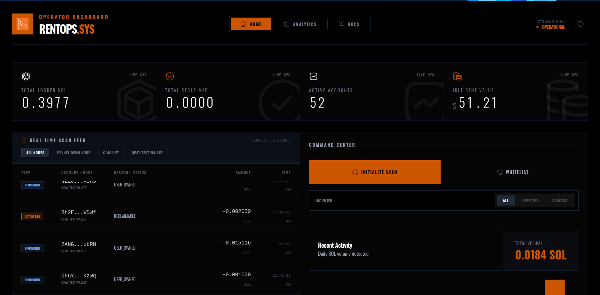
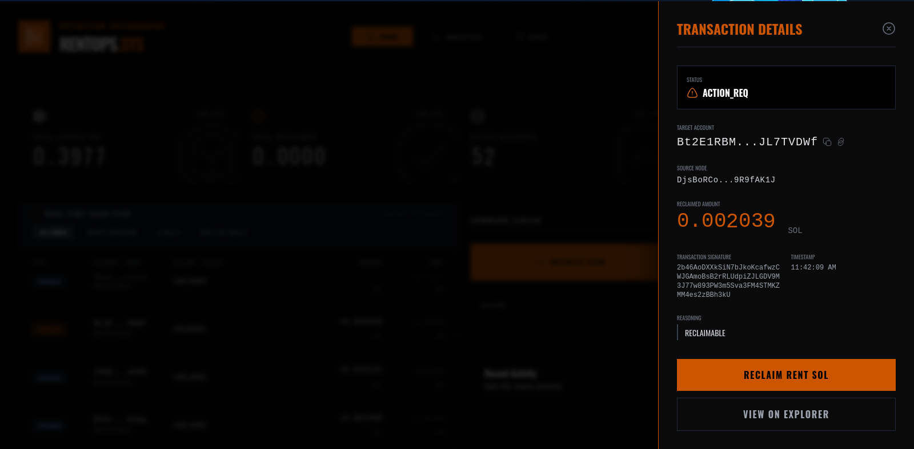
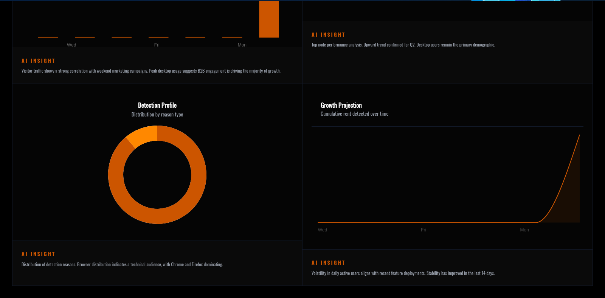
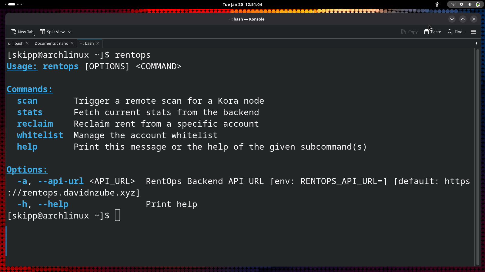
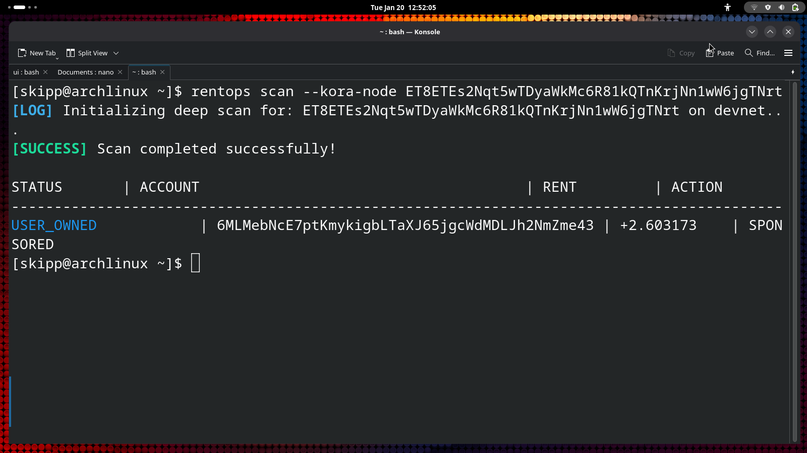
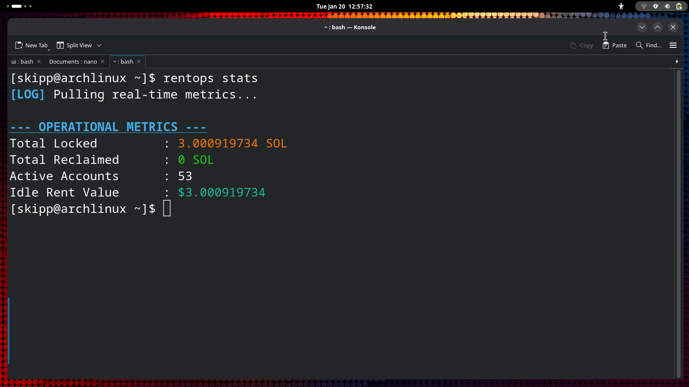

> # RentOps

**Recover Dormant SOL. Optimize Kora Operations. Zero Latency.**

RentOps is the missing operational layer for the Kora Protocol. It automates the detection and recovery of rent-exempt SOL locked in sponsored accounts, preventing silent capital bleed for node operators.

## Access Points

| Interface | Description | Access |
|-----------|-------------|--------|
| **Web Dashboard** | Real-time monitoring, visual analytics, and interactive reclamation. | [Launch Console](https://rentops.davidnzube.xyz) |
| **CLI** | Headless, scriptable automation for high-volume node operators. | [Install CLI](https://github.com/rentops/binaries) |
| **Telegram Bot** | Instant alerts and status reports on the go. | [Start Bot](https://t.me/RentOpsBot) |

## The Theory

When a Kora Node sponsors a user's transaction or account creation, it pays the **Rent-Exempt Minimum** (~0.002 SOL). If the user abandons the application, that capital remains locked on-chain indefinitely.

RentOps solves this by:
1.  **Introspection:** Scanning the node's transaction history to identify all sponsored accounts.
2.  **Classification:** Distinguishing between **Operator-Owned** accounts (immediately reclaimable) and **User-Owned** accounts (requiring delegated authority).
3.  **Reclamation:** Safely closing eligible accounts and returning the rent to the operator's treasury.

## Infrastructure & Security

RentOps deals with private keys to sign closure transactions. For maximum security, we strongly recommend deploying your own instance of the RentOps infrastructure.

[→ Deploy Your Own Infrastructure](https://rentops.davidnzube.xyz/docs/installation)

## Gallery

  
  
  
  
  
  

